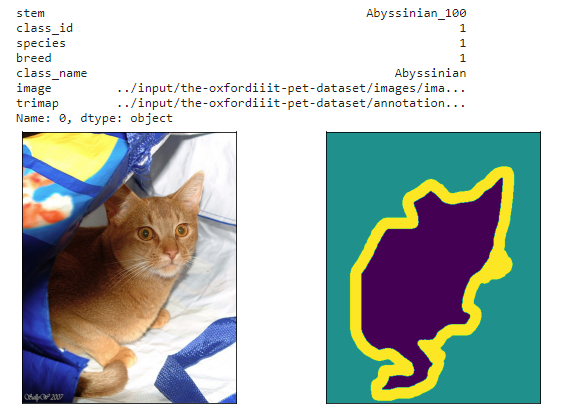
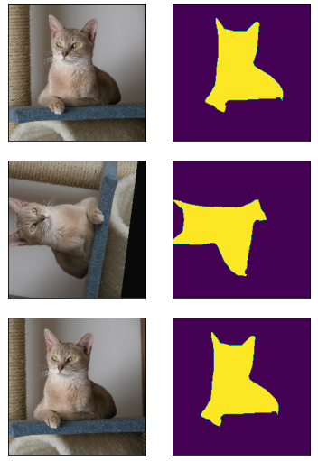
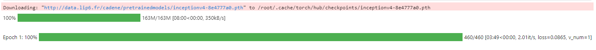

# TP SEGMENTATION

## Data set

Composed of different pictures of cats and dogs.

## Use of different models

To start with, different models were used:
```bash
Mobile_net_v2 185/185 [==============================] - 38s 207ms/step - loss: 0.0000e+00 - accuracy: 0.0517 - val_loss: 0.0000e+00 - val_accuracy: 0.0507

Inception_v3 185/185 [==============================] - 40s 217ms/step - loss: 0.0000e+00 - accuracy: 0.5686 - val_loss: 0.0000e+00 - val_accuracy: 0.5804

Resnet_50 185/185 [==============================] - 40s 214ms/step - loss: 0.0000e+00 - accuracy: 0.0451 - val_loss: 0.0000e+00 - val_accuracy: 0.0533
```

We can see that the scores of the models have not moved at all, even after the first epoch. 
The models with the Inception_v3 base seem to get a better rendering than the other models.
So I will continue with Inception_v3

## Making the XPs

I made these pictures from the `segmentation_colab` notebook:

- Description and parameters of a picture:  



- Segmentation tracking on a modified photo:  


## Results

These next two results are from two different notebooks:

- Example of a result under Inception_v4


- And under ResNet50
```bash
INFO:tensorflow:Calling model_fn.
ERROR:tensorflow:Operation of type Placeholder (input_1) is not supported on the TPU. Execution will fail if this op is used in the graph. 
/usr/local/lib/python3.6/dist-packages/keras_applications/resnet50.py:265: UserWarning:

The output shape of `ResNet50(include_top=False)` has been changed since Keras 2.2.0.

INFO:tensorflow:Done calling model_fn.
INFO:tensorflow:Starting evaluation at 2019-05-23T16:33:37Z
INFO:tensorflow:TPU job name worker
INFO:tensorflow:Graph was finalized.
INFO:tensorflow:Restoring parameters from gs://gs_colab/work/tutorial8/2019-05-23-16:28:08/model.ckpt-460
INFO:tensorflow:Running local_init_op.
INFO:tensorflow:Done running local_init_op.
INFO:tensorflow:Init TPU system
INFO:tensorflow:Initialized TPU in 10 seconds
INFO:tensorflow:Starting infeed thread controller.
INFO:tensorflow:Starting outfeed thread controller.
INFO:tensorflow:Initialized dataset iterators in 0 seconds
INFO:tensorflow:Enqueue next (1) batch(es) of data to infeed.
INFO:tensorflow:Dequeue next (1) batch(es) of data from outfeed.
INFO:tensorflow:Evaluation [1/1]
INFO:tensorflow:Stop infeed thread controller
INFO:tensorflow:Shutting down InfeedController thread.
INFO:tensorflow:InfeedController received shutdown signal, stopping.
INFO:tensorflow:Infeed thread finished, shutting down.
INFO:tensorflow:infeed marked as finished
INFO:tensorflow:Stop output thread controller
INFO:tensorflow:Shutting down OutfeedController thread.
INFO:tensorflow:OutfeedController received shutdown signal, stopping.
INFO:tensorflow:Outfeed thread finished, shutting down.
INFO:tensorflow:outfeed marked as finished
INFO:tensorflow:Shutdown TPU system.
INFO:tensorflow:Finished evaluation at 2019-05-23-16:34:01
INFO:tensorflow:Saving dict for global step 460: accuracy = 0.9089674, global_step = 460, loss = 0.29057366
INFO:tensorflow:Saving 'checkpoint_path' summary for global step 460: gs://gs_colab/work/sample_data/2019-05-23-16:28:08/model.ckpt-460
INFO:tensorflow:evaluation_loop marked as finished
```

Overall, ResNet performed better than Inception_v4, despite my early testing.